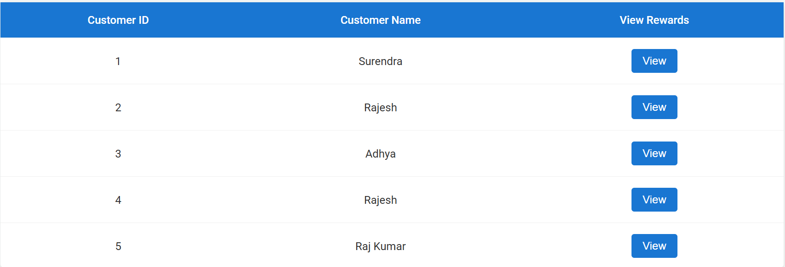
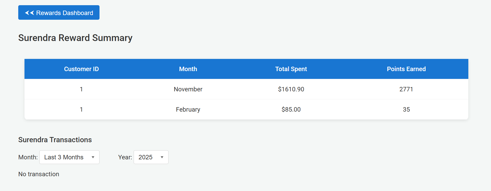
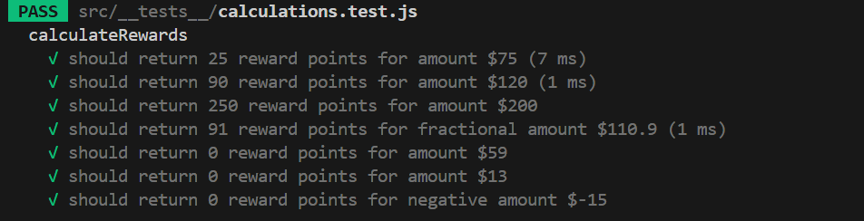

## Project Overview

A React.js application that calculates customer reward points based on their transactions. The reward points are calculated using the following criteria:

- **1 point** for every dollar spent between **$50 - $100**
- **2 points** for every dollar spent over **$100**

This application:

- Fetches transactions from the Dummy Transaction JSON
- Display Customer Dashboard with list of Customers
- Displays customer reward points per month
- Allows filtering transactions by customer & month
- Implements pagination for better UX
- Uses styled-components for UI styling
- Includes unit tests for calculations

---

## Features

- **Reward Points Calculation**
- **Monthly Filtering**
- **Pagination**
- **API Simulation**
- **Unit Testing**
- **Styled Components**

---

## Installation & Setup

### **1. Clone the Repository**

```sh
git clone https://github.com/msurendra4/CustomerRewardApp.git
cd code-evaluation
```

### **2. Install Dependencies**

```sh
npm install
```

### **3. Run the Application**

```sh
npm run dev
```

### **4. Run the Test Case**

```sh
npm test
```

---

## Usage

1. Open the application in your browser.
2. View the list of customers.
3. Click on "View" to see a customer's rewards per month.
4. Filter transactions by selecting a specific month.
5. Use pagination to navigate large datasets.

---

## Deployment

The application has been deployed on Vercel. You can view the live application here:
https://customerrewardapp1.vercel.app/

## Screenshots




## Test Case


